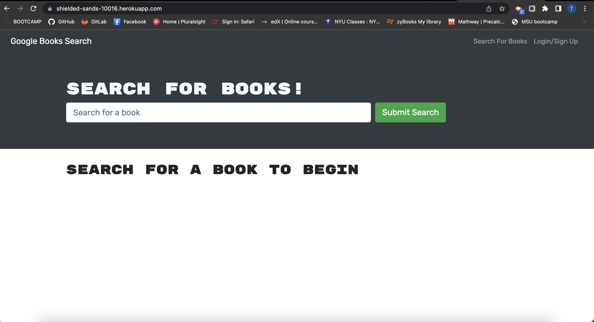
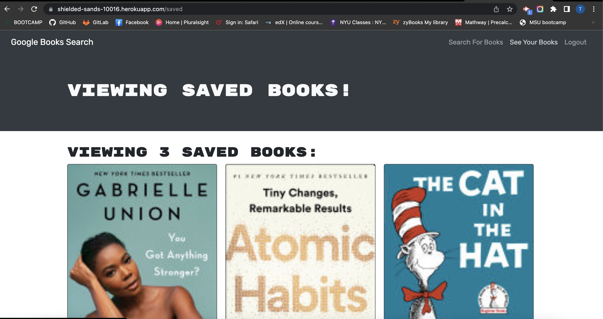

# Book Search Engine
  

## Description

  This is a code refactor of a fully functioning Google Books API search engine built with a RESTful API, to be a GraphQL API built with Apollo Server. The app was built using the MERN stack, with a React front end, MongoDB database, and Node.js/Express.js server and API. It's already set up to allow users to save book searches to the back end.

## Table of Contents

* [Installation](#installation)
* [Usage](#usage)

* [Contributing](#contributing)

* [Questions](#questions)

  

## Installation

  1. Download the repository.
  2. Run `npm i` or `npm install` on the directory.
  3. Run `npm run develop` on the same directory to have both server and client running at the same time.

## Usage
  Access the deployed app here: https://shielded-sands-10016.herokuapp.com/

  
  
    Often times junior-level programmers are tasked with taking an existing, perfectly working app and have to make it do the same thing but more efficiently. This was solid practice for doing just that, and practice like this gives me a good idea where to start in future projects like this.

## License
[MIT License](https://choosealicense.com/licenses/mit/)

## Questions
You can view the repo here [GitHub Repo](https://github.com/favro03/book-search-engine)

[Contact Us](mailto:wetr9902@gmail.com)